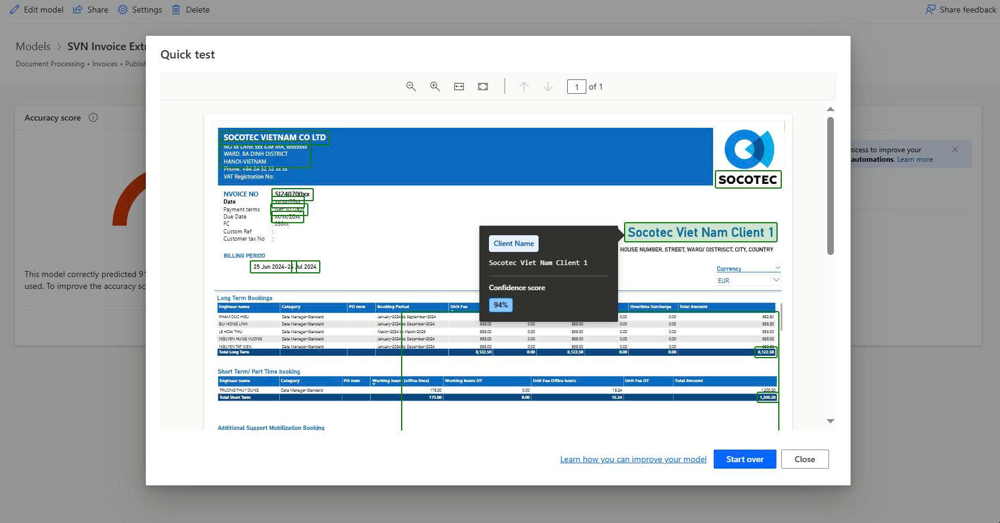
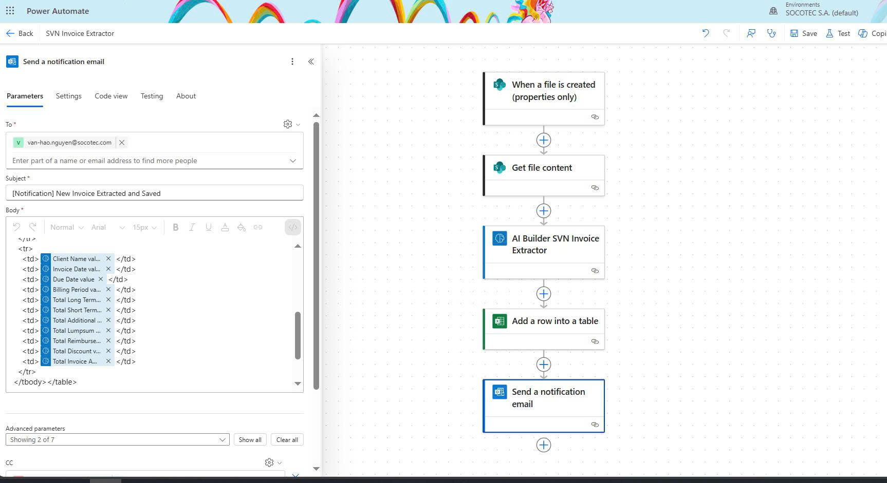

# 📄 Automating Invoice Processing with AI Builder & Power Automate

## 🚀 Overview
This project demonstrates how to automate the **invoice processing workflow** using **Microsoft AI Builder** and **Power Automate**.

By combining **AI-powered data extraction** with **automated workflows**, the solution eliminates repetitive manual work and ensures fast, accurate, and consistent handling of invoices.

---

## ✨ Features

### 🤖 AI Builder Custom Model
- Trained with only **40 sample invoices**
- Achieved **88–99% accuracy** in extracting key fields:
  - Invoice Number  
  - Invoice Date  
  - Due Date  
  - Total Invoice Amount  
  - …and more



### 🔁 End-to-End Automation with Power Automate
- Detects when a new invoice is uploaded to **SharePoint**
- Runs **AI model** to extract invoice data
- Logs structured results into **Excel Online** for reporting
- Sends automatic **Outlook notifications** to relevant teams

---

## 🛠️ Architecture

```mermaid
flowchart TD
    A[Upload Invoice to SharePoint] --> B[Trigger Power Automate Flow]
    B --> C[Run AI Builder Model for Data Extraction]
    C --> D[Validate & Normalize Data]
    D --> E[Store Data in Excel Online Table]
    E --> F[Send Outlook Notification]
    F --> G[Data Ready for Reporting in Power BI/Excel]
📊 Benefits

⏱️ Save hours of manual data entry

🎯 High accuracy with AI Builder

📂 Centralized and structured data for analysis

📧 Instant notifications and visibility

📈 Scalable for future invoice volumes

🔧 Tech Stack

Microsoft AI Builder (Form Processing model)

Microsoft Power Automate (Cloud Flows)

SharePoint Online (Invoice storage)

Excel Online / Dataverse (Data storage and reporting)

Outlook / Teams (Notifications & collaboration)

📌 Next Improvements

Add validation rules (e.g., duplicate invoice detection).

Integrate with ERP/Finance system for end-to-end automation.

Extend to multi-language invoices.


✍️ Developed by: NGUYEN VAN HAO


